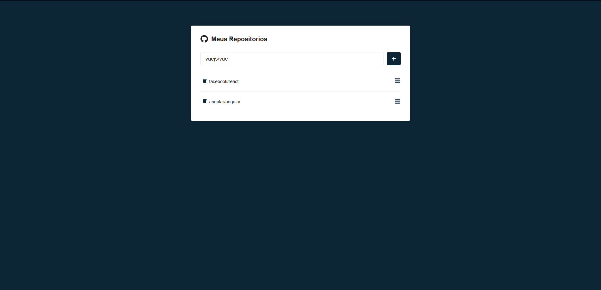

# Busca de Repositorio Web - Pt-br

Esse é meu primeiro projeto completo que fiz puramente com React como teste para conhecer mais a ferramenta com ele você pode pesquisar sobre repositorios como está na imagem e verificar as issues abertas, fechadas ou ambas.

Tela de Pesquisa


Tela do Repositório


## Scripts

Caso queria rodar o codigo, baixe o codigo e certificando que tenha o **Node.js** instalado na sua máquina e execute os seguintes comandos: 

``` 
npm install
and
npm start
```
<br>
<br>
<br>

# Web Repository Search - En-us

This is my first complete project that I did purely with React as a test to get to know the tool better. With it, you can search for repositories as shown in the image and check open, closed issues or both.

Search Screen


Repository Screen


## Scripts

If you want to run the code, download the code and make sure you have **Node.js** installed on your machine and run the following commands:

``` 
npm install
and
npm start